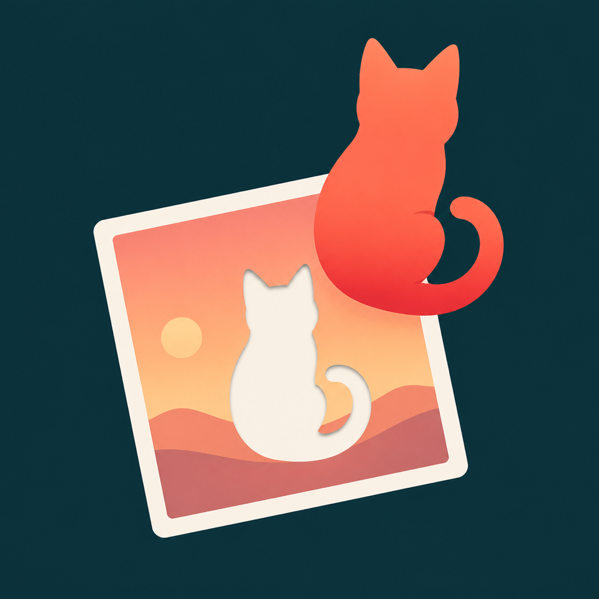
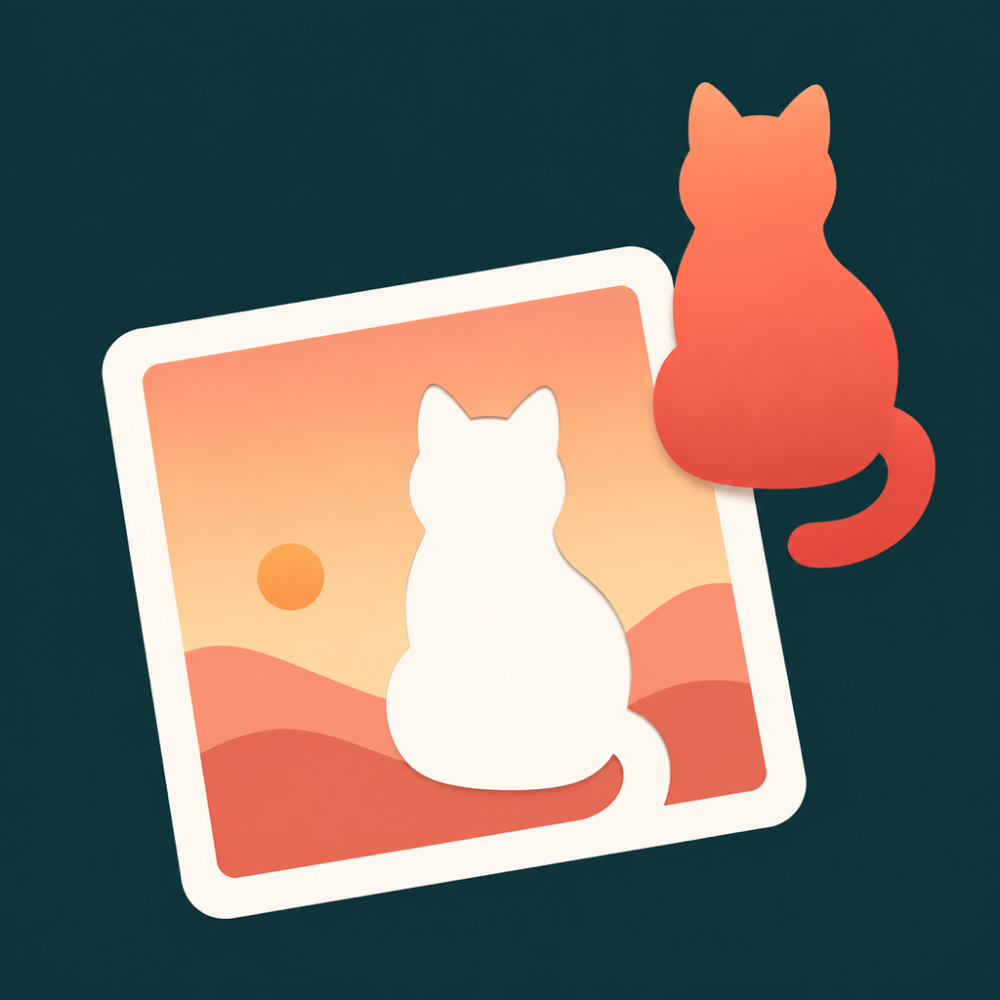
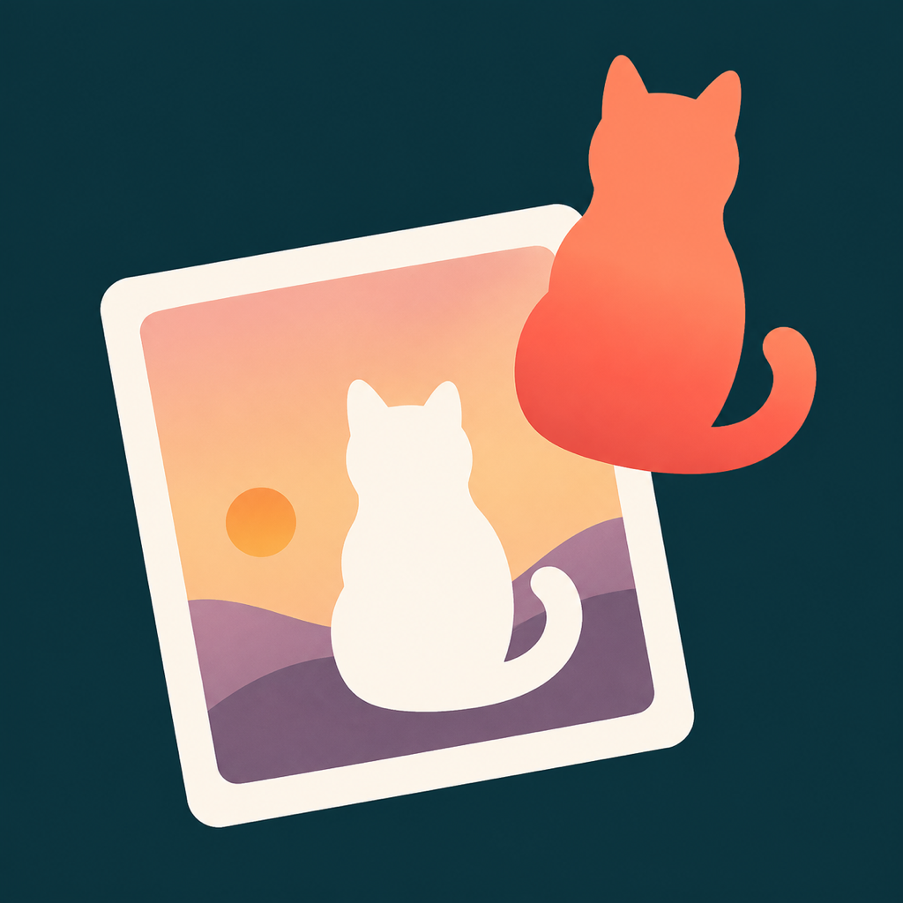
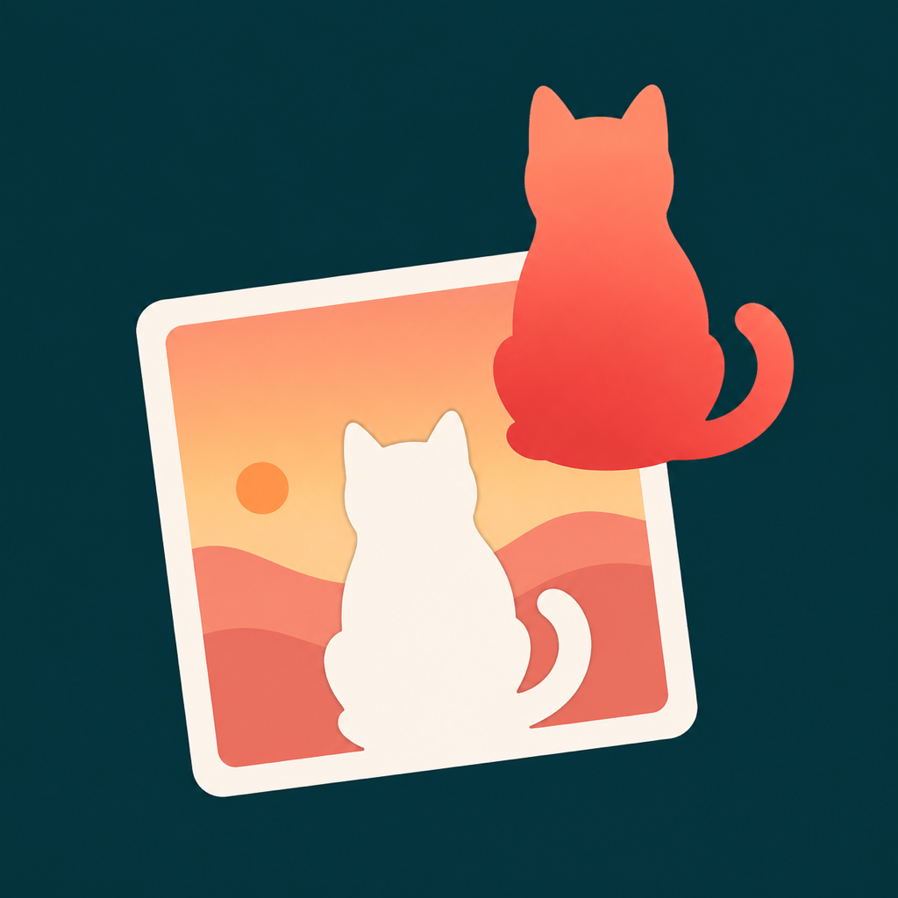
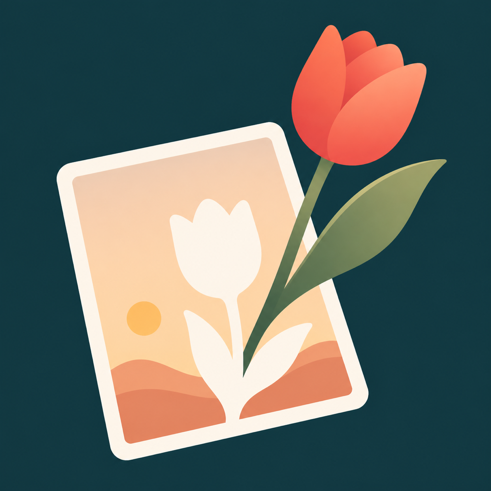

# Pluck app icon · image-generation concepts

Generated from [`icon-brief.md`](../icon-brief.md) with the built-in ImageGen path. These are concept references for selection and later layered SVG reconstruction; they are not Icon Composer-ready deliverables.

## Portrait

| 1 | 2 | 3 | 4 | 5 | 6 |
|---|---|---|---|---|---|
|  |  |  |  |  |  |
|  |  |  |  |  |  |

## Cat

| 1 | 2 | 3 | 4 | 5 | 6 |
|---|---|---|---|---|---|
|  |  |  |  |  |  |
|  |  |  |  |  |  |

## Flower

| 1 | 2 | 3 | 4 | 5 | 6 |
|---|---|---|---|---|---|
|  |  |  |  |  |  |
|  |  |  |  |  |  |

## First-pass assessment

- Strongest overall direction: `cat-1`. The subject silhouette, matching hole, photo card, and lift direction remain readable at 32 px.
- Strongest portrait direction: `portrait-3`. The clean vertical gap communicates extraction more directly than the overlapping variants.
- Strongest flower direction: `flower-3`. It preserves a complete flower silhouette and a clear before/after relationship at small size.
- Reject `flower-4` for the next round: its green stem and leaf break the specified all-coral subject treatment.

## Export verification

```sh
sips -g pixelWidth -g pixelHeight 1024/*.png
sips -g pixelWidth -g pixelHeight 32/*.png
```

Expected output: eighteen 1024×1024 PNGs and eighteen 32×32 PNGs.
